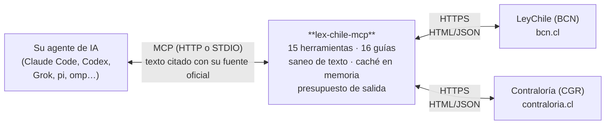

# Lex Chile MCP Server

[](https://podman.io/)
[](https://www.docker.com/)
[](https://modelcontextprotocol.io/)
[](https://go.dev/)
[](https://opensource.org/licenses/MIT)

Servidor MCP que proporciona a su agente de IA acceso estructurado a las leyes chilenas — **LeyChile (BCN)** — y a la jurisprudencia administrativa de la **Contraloría General de la República (CGR)**. Las respuestas se construyen con texto citado de la fuente oficial.

## Qué es y qué no es

- **Es** una herramienta de orientación: permite buscar normas, leer su texto vigente, comparar versiones y consultar la jurisprudencia administrativa que interpreta cómo se aplican las leyes en el país.
- **No es** asesoría legal. No reemplaza el criterio de un profesional del derecho ni la lectura formal de los textos legales. El carácter vinculante de una norma o la interpretación definitiva corresponden exclusivamente a las instancias oficiales competentes.
- **Verifique siempre** en la fuente oficial ([bcn.cl](https://www.bcn.cl) / [contraloria.cl](https://www.contraloria.cl)) antes de actuar sobre cualquier información recibida.
- Proyecto comunitario: no está afiliado a la BCN, a Contraloría ni al Estado.

## Cómo funciona



- El servidor está escrito en Go y expone **15 herramientas** (5 de BCN y 10 de CGR) más **16 guías** que le enseñan al modelo el flujo de trabajo: buscar, verificar y citar paso a paso.
- Todo el texto que proviene de los servicios públicos se **sanea** antes de llegar al modelo (se eliminan etiquetas, entidades y ruido del HTML original).
- Una **caché en memoria** evita repetir descargas idénticas y un **presupuesto de salida** impide que una norma extensa sature el contexto del modelo; en ese caso el servidor entrega un mapa navegable de la norma para leerla por secciones.
- El servidor **no persiste datos**: la configuración va embebida en el binario y las cachés viven solo en memoria.

La referencia completa de herramientas está en [TOOLS.md](TOOLS.md).

## Qué puede hacer

**Leyes y normas (LeyChile):**
- Buscar leyes, decretos y resoluciones por texto ("Ley 21.600", "arriendo").
- Leer la norma en Markdown con su estructura y artículos, completa o por sección.
- Obtener el resumen oficial antes de leer el texto completo.
- Consultar la versión vigente en cualquier fecha pasada.
- Revisar la historia legislativa: qué leyes la modificaron y a cuáles modificó.

**Contraloría — jurisprudencia administrativa en 8 fuentes:**
- Dictámenes (jurisprudencia vinculante), instructivos generales, oficios contables, informes de auditoría, consolidados CIC, sentencias del Juzgado de Cuentas, legislación (toma de razón) y contexto web.
- Búsqueda única multi-fuente (`search_cgr`) con ficha individual por tipo de documento, y conteo opcional por tipo para dimensionar una búsqueda.

## Precauciones de uso

- **Servicios públicos**: las consultas llegan a bcn.cl y contraloria.cl. Deje 3-4 segundos entre llamadas a Contraloría y evite búsquedas masivas o reintentos en bucle; el objetivo es no saturar servicios gratuitos de uso público.
- **Volumen de datos**: las normas pueden tener cientos de miles de caracteres y algunos informes de auditoría son extensos. El servidor trunca contenidos muy grandes (con el enlace al PDF oficial) y degrada las normas enormes a un mapa navegable; prefiera resúmenes y lecturas por sección antes que documentos completos.
- **Orientación, no asesoría**: todo resultado es referencial. Confirme el texto vigente y su interpretación con un profesional y en las fuentes oficiales.

## Ejemplos de uso

```
Busque la Ley 21.600
→ encuentra la norma (norm_id 1195666) con su resumen oficial

¿Qué dice el artículo 1 de la Ley 21.600?
→ muestra el texto del artículo citando la fuente

Busque dictámenes de Contraloría sobre "bonos"
→ lista de resultados con enlace al PDF oficial

Busque el instructivo IN23 sobre día funcionario municipal
→ ficha del instructivo con su texto y enlaces

Busque el oficio contable E080961 (NICSP)
→ ficha del oficio con destinatarios y texto

Compare la Ley 20.000 entre 2015 y 2020
→ reporte de artículos agregados, modificados o eliminados
```

## Inicio rápido

```bash
podman pull ghcr.io/alvarosdev/lex-chile-mcp:latest
podman run -d --name lex-chile-mcp -p 8000:8000 ghcr.io/alvarosdev/lex-chile-mcp:latest
curl http://localhost:8000/health   # {"status":"healthy"}
```

Para instalarlo por otras vías (binario, compilación, Docker, compose), ejecutarlo en modo STDIO y conectarlo a su agente (Claude Code, Codex, Grok, pi, Oh My Pi), consulte [INSTALL.md](INSTALL.md).

## Documentación

- [INSTALL.md](INSTALL.md) — instalación, modos de ejecución (HTTP/STDIO), contenedores y conexión de agentes.
- [TOOLS.md](TOOLS.md) — referencia técnica de las 15 herramientas y las 16 guías.

## Aviso y licencia

Uso informativo y educativo. El servidor no guarda sus datos (solo memoria temporal) y no debe utilizarse para saturar los servicios públicos consultados. Verifique siempre en la fuente oficial.

**Sin garantía (tal cual, "as is").** Este software se entrega "tal cual" y "según disponibilidad", sin garantía de ningún tipo, expresa o implícita, incluidas, entre otras, las garantías de comerciabilidad, aptitud para un propósito particular y no infracción. En ningún caso los autores o titulares de derechos serán responsables de reclamaciones, daños u otras responsabilidades, derivadas del software o del uso que se le entregue. La información que entrega este servidor es orientativa: no constituye asesoría legal y debe verificarse en las fuentes oficiales.

> This software is provided "as is" and "as available", without warranty of any kind, express or implied, including but not limited to the warranties of merchantability, fitness for a particular purpose, and noninfringement. In no event shall the authors or copyright holders be liable for any claim, damages, or other liability arising from, out of, or in connection with the software or its use. The information provided by this server is for orientation only; it is not legal advice and must be verified against official sources.

El texto normativo completo de la licencia y de la limitación de responsabilidad se encuentra en [LICENSE](LICENSE). Créditos de terceros en [THIRD_PARTY_NOTICES](THIRD_PARTY_NOTICES).
